### Readme

Name: Fariz Rizky Haykal Abdillah

## Definition of Done

1. Base Dockerfile
    - Steps:
  
        To build required docker images, simply go to the root host where `docker-compose.yaml` file is located and run command `docker-compose build`.
           
    - Image size:
    
        Result measured by `docker image ls` at `SIZE` column

        - `jakmall/recruitment/cloud-engineer/counter/nginx`: `22.6MB`
        - `jakmall/recruitment/cloud-engineer/counter/php-fpm`: `90.2MB`
        - `jakmall/recruitment/cloud-engineer/counter/php-cli`: `88.7MB`

2. Local Docker Compose
    - Reminder:
        - Docker is running in virtual box using Centos 7 OS, where the localhost of the service in docker currently using domain 'jenkins.local'.
        - Before running the whole service, make sure the .env and .env.local exists with the matching environment variables.
        - I have created `infra` script file to run the whole services and other executions, to initialize the infrastructure for the first time run command `./infra init` where the file is located.
        - Notice in my implementation there is a bug where php artisan migration can't connect with mysql database but then when I shutting down the whole service and running the `./infra init` command again it works just fine to do the migration.
    
    - Visit `http://localhost:[DOCKER_COMPOSE_NGINX_HOST_PORT]`, you must see a working page of counter page, every refresh will counter the number. In this implementation the web counter page is mapped into port 80 so then user can see if the counter page will be counted every time it is refreshed.

        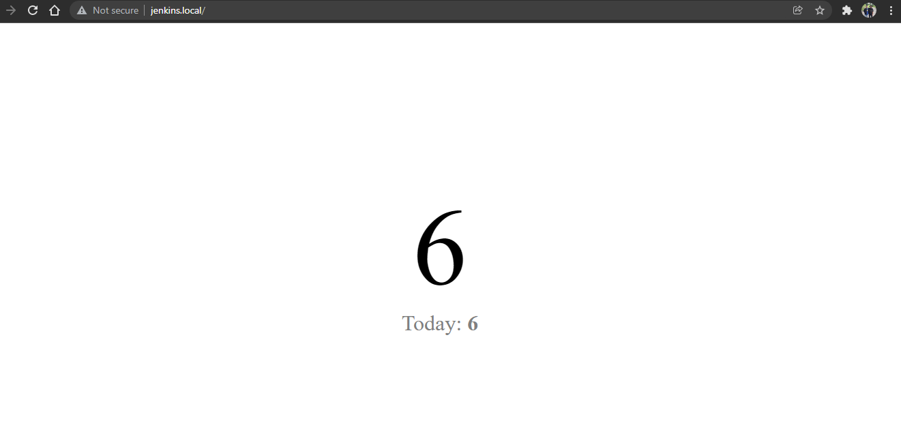

    - Every refresh is dispatching a queue and must be processed by the **worker** service, you could confirm by inspect the **worker** service logs, run command `./infra logs worker` to see the result.

        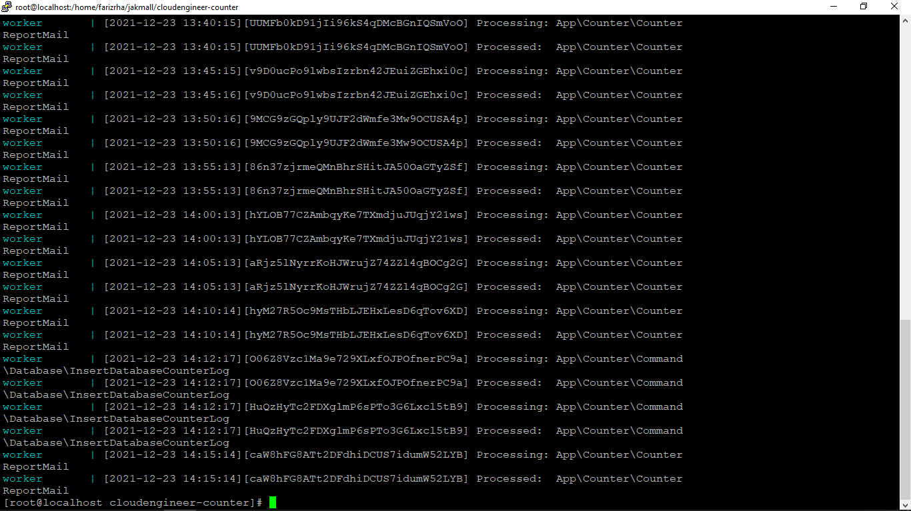

    - Run command `./infra mysql` to get into mysql database as a root, the password is `secret` and check data inserted by the queue by login to **mysql** service and run this query `select * from counter.counter_log;`

        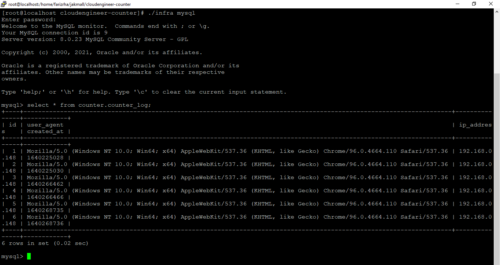

    - To confirm the scheduler is running correctly, visit `http://localhost:[DOCKER_COMPOSE_MAILHOG_HOST_PORT]`, there must be emails in the inbox every 5 minutes

        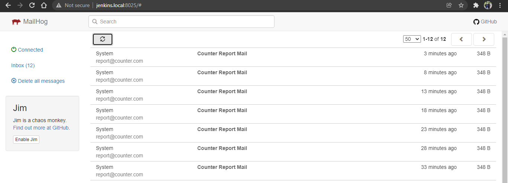

    - The file created by the application is belonged to the `DOCKER_COMPOSE_USER` and `DOCKER_COMPOSE_USER_GROUP`, in this example `DOCKER_COMPOSE_USER` is `www-data` and represent in id `1002` but in the result is belonged to root, the command `ls -lah bootstrap/cache` is run inside **worker** service by using command `./infra sh worker` as shortcut.

        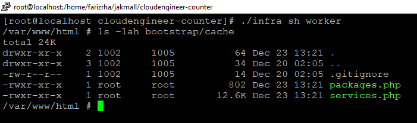

3. Bash Tools
    - init
        - Start from scratch, clone the project into new folder
        - Set `.env.docker-compose` file
        - Execute `./infra init`
        - After all steps executed, all services and other `infra` commands must fully functional without any added manual step
    - up
        - All services are run in the background

            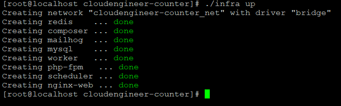

    - down
        - All resources are cleaned up

            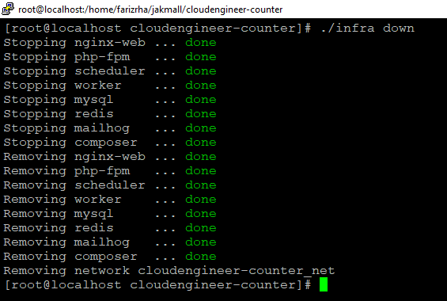

    - build
        - All services image are built successfully without any added manual step
        - If no service given `./infra build`, build all services
        - If single service or multiple services given `./infra nginx php-fpm`, only build the given service or services
    - logs
        - If no service given `./infra logs`, show logs from all services
        - If single service or multiple services given `./infra logs nginx php-fpm`, only show the logs for the given service or services

            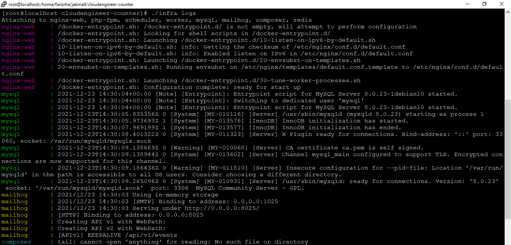
 
    - restart
        - If no service given `./infra restart`, restart all services
        - If single service or multiple services given `./infra restart nginx php-fpm`, only restart the given service or services

            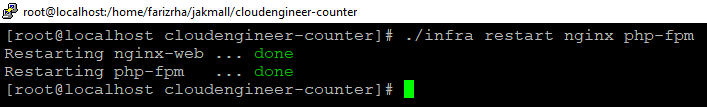

    - sh
        - Exec sh to the given service `./infra sh worker`
        - If no service given, print help

            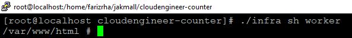

    - artisan
        - If no arguments given `./infra artisan`, the default for artisan command is print help
        - Try to execute with given arguments such as `./infra artisan migrate --seed`, migrate and seed command must be run

            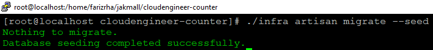

    - test
        - If no arguments given `./infra test`, the default for phpunit is run all testcase, all test case must be success
        - Try to execute with given arguments such as `./infra test tests/Unit/CacheCounterCommandQueryTest.php`, phpunit must only run the test case for given file

            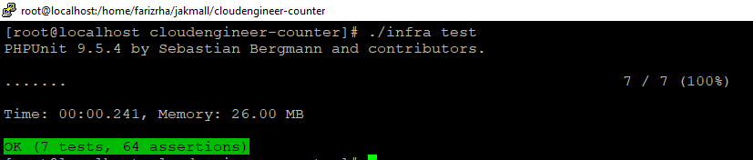

    - composer
        - If no arguments given `./infra composer`, the default composer command print the help
        - Try to execute with given arguments such as `./infra composer dump-autoload`, composer must run the given arguments
        - Any file generated by composer service must belong to the `DOCKER_COMPOSE_USER` and `DOCKER_COMPOSE_USER_GROUP`

            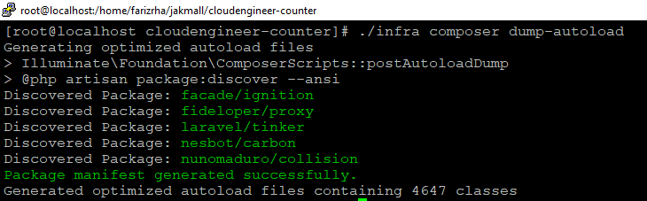

    - mysql
        - Login to the mysql as root and able to do query `./infra mysql`

            

    - redis
        - Login to the redis-cli and able to do query `./infra redis`

            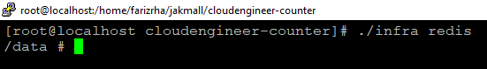

    - help
        - Print the help in color and use the same exact words

            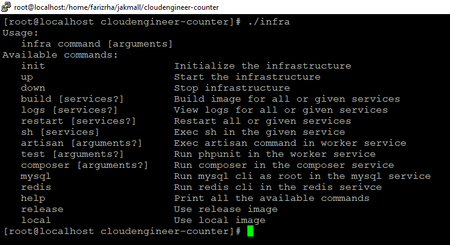

4. Release

    - I can not complete this task due to the limited time I have.

   

